# SatLotto System Documentation

## 1. Arquitectura General

### Stack Tecnológico
- **Frontend**: Next.js 16 (React, TypeScript, Turbopack)
- **Base de Datos**: Neon PostgreSQL (serverless)
- **Wallet**: Nostr Wallet Connect (NWC) via Alby
- **Auth**: NIP-46 (Bunker), NIP-07 (Extensions), NIP-55 (Amber), NWC Direct
- **Nostr**: NDK, nostr-tools
- **Styling**: Plain CSS modular (src/style/)
- **Testing**: Vitest (unit/integration/security), Playwright (E2E)
- **Cron**: GitHub Actions (sin límite de ejecuciones)

### Componentes Principales
```
src/
├── app/
│   ├── api/
│   │   ├── bet/route.ts           # Crear/obtener apuestas
│   │   ├── state/route.ts         # Estado global del juego
│   │   ├── cron/process-round/    # Endpoint para announcements Nostr
│   │   └── identity/[pubkey]/     # Perfiles de usuarios
│   └── page.tsx                   # Página principal
├── style/
│   ├── base.css                   # Variables, reset, header
│   ├── layout.css                 # Game container, panels, footer
│   ├── clock.css                  # Clock, numbers, markers
│   ├── animations.css              # Keyframes
│   └── components/
│       ├── _auth.css              # Auth buttons, tabs, NWC
│       ├── _modal.css             # Modals
│       ├── _qr.css                # QR components
│       ├── _pay-btn.css           # Pay button states
│       ├── _user-panel.css        # User panel, logout
│       └── _pin.css               # PIN input
├── components/
│   ├── modals/
│   │   ├── ChampionModal.tsx       # Modal de victoria
│   │   ├── PotentialWinnerModal.tsx # Modal potencial ganador
│   │   ├── LoginModal.tsx           # Login NIP-46/NWC
│   │   └── InvoiceModal.tsx         # Invoice para pago manual
│   ├── Clock.tsx              # Reloj del sorteo
│   ├── CenterButton.tsx       # Botón central (apostar/pagar)
│   ├── BetsTable.tsx           # Tabla de apuestas
│   ├── ChampionsTable.tsx     # Hall of fame
│   └── DebugButtons.tsx       # Botonera de debug
├── contexts/
│   ├── AuthContext.tsx        # Autenticación
│   └── GameContext.tsx        # Estado del juego
├── hooks/
│   ├── usePayment.ts          # Lógica de pago
│   ├── useAuthStore.ts        # Auth state store
│   └── useVictoryCelebration.tsx # Animación de victoria
└── lib/
    ├── db.ts                  # Conexión Neon + CRUD
    ├── cache.ts               # Sync de bloques
    ├── nip46.ts               # Bunker NIP-46
    ├── nip55.ts               # Amber signer NIP-55
    ├── nip07.ts               # Extension NIP-07 (Alby, nos2x)
    ├── nwc.ts                 # NWC client
    ├── ln.ts                  # Lightning address utilities
    ├── nostr.ts               # NDK setup, DM, publish
    ├── ndk.ts                 # NDK instance
    ├── champion-call.ts        # Payout processing
    ├── crypto.ts              # PIN encryption for NWC
    └── rate-limiter.ts        # Rate limiting

.github/
└── workflows/
    └── cron.yml               # GitHub Actions cron (cada 5 min)
```

---

## 2. Flujo de Autenticación

### 2.1 NIP-07 Extension (Alby, nos2x)

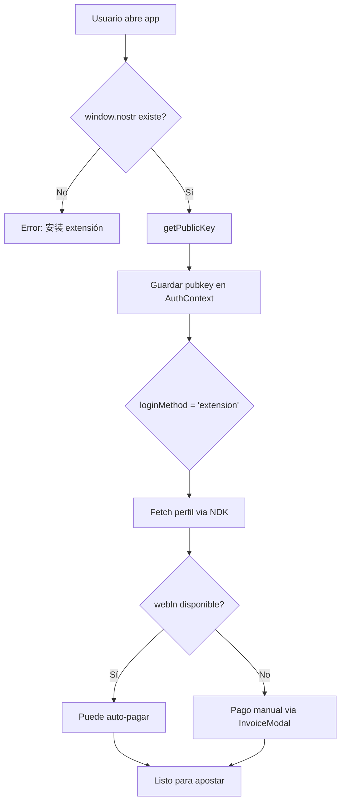

**Nota**: Alby tiene `window.webln` → puede pagar directamente. nos2x NO tiene `window.webln` → el pago se hace vía InvoiceModal (manual).

**Archivos**: `src/lib/nip07.ts`, `src/utils/auth-methods.ts`

### 2.2 NWC URL Directo

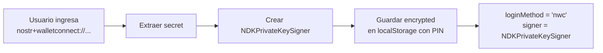

**Archivos**: `src/lib/nwc.ts`, `src/utils/auth-methods.ts`, `src/lib/crypto.ts`

### 2.3 NIP-46 Bunker (QR Code)

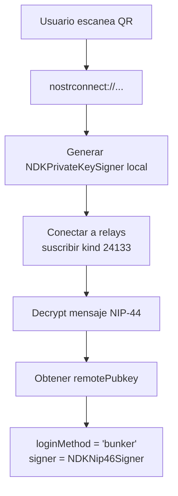

**Archivos**: `src/lib/nip46.ts`, `src/components/QR.tsx`

### 2.4 NIP-55 Amber (Mobile)

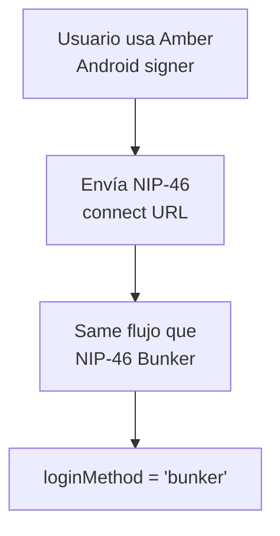

---

## 3. Flujo de Apuesta

### 3.1 Colocación de Apuesta

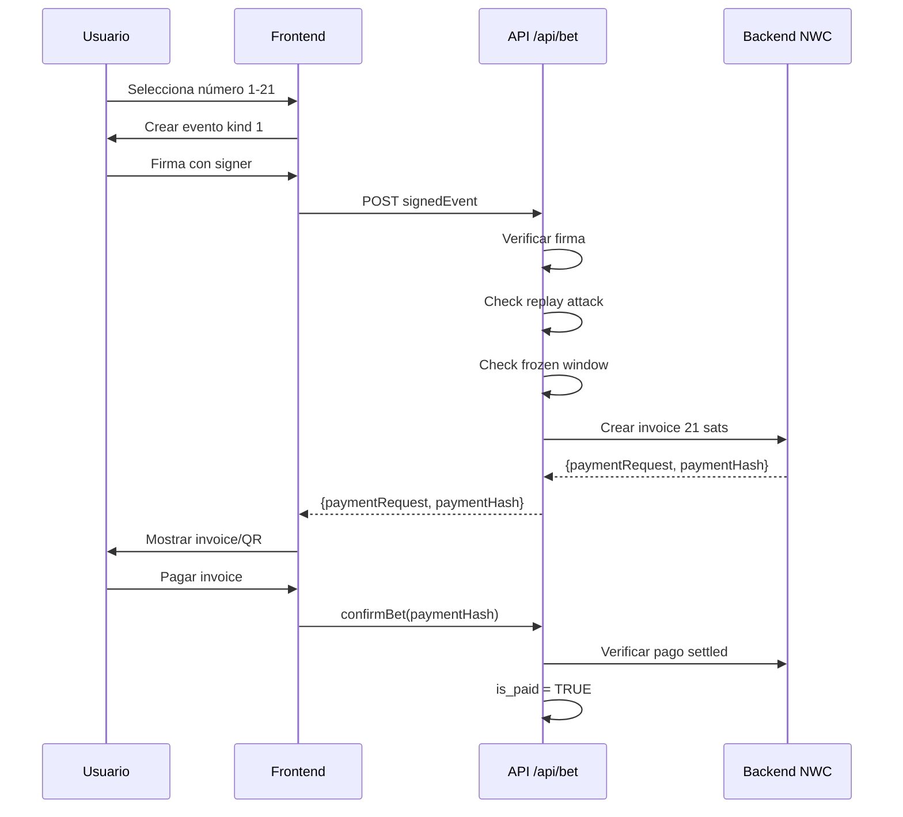

### 3.2 Pago según Login Method

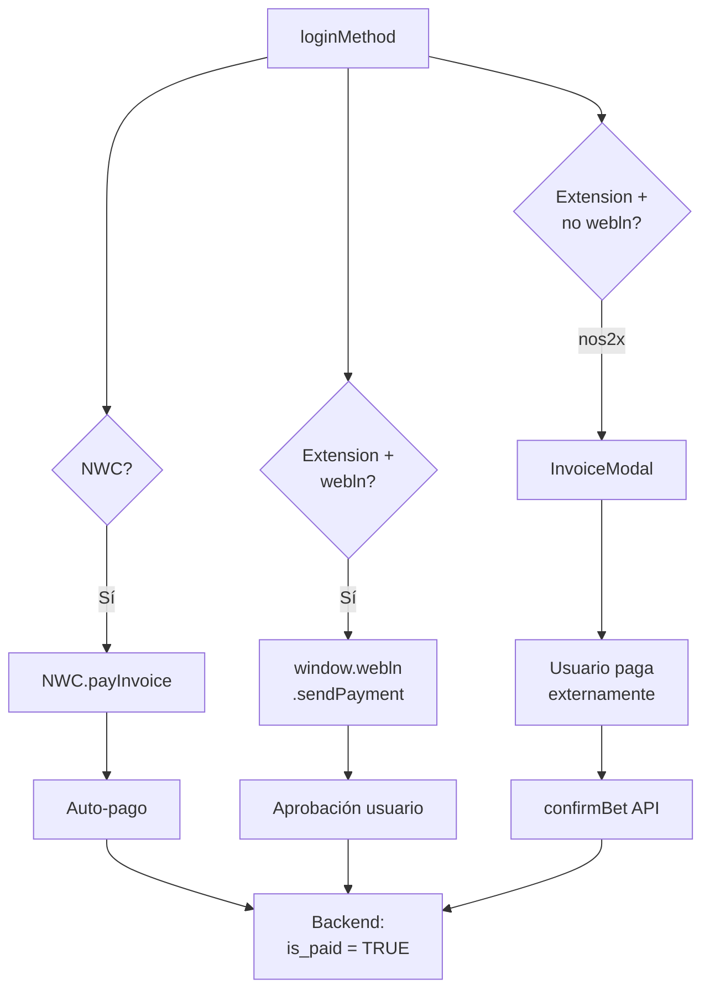

### 3.3 Cambio de Número (Misma Ronda)

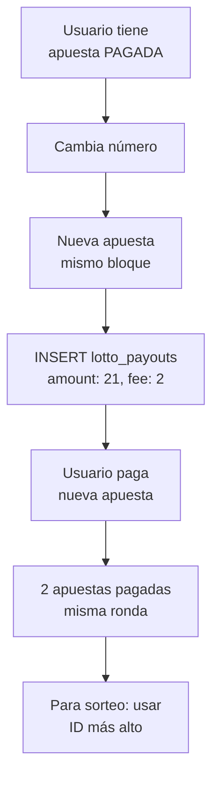

**Nota**: No hay reintegro. Si apostás 2 veces, pagás 2 veces (42 sats).

---

## 4. Determinación de Ganador

### 4.1 Cálculo del Número Ganador

```mermaid
flowchart TD
    A[current_block] --> B[target = ceil(block / 21) * 21]
    B --> C[Obtener block_hash<br/>desde mempool.space]
    C --> D[winning_number<br/>= (block_hash[0] % 21) + 1]
```

### 4.2 Protección contra Reorgs

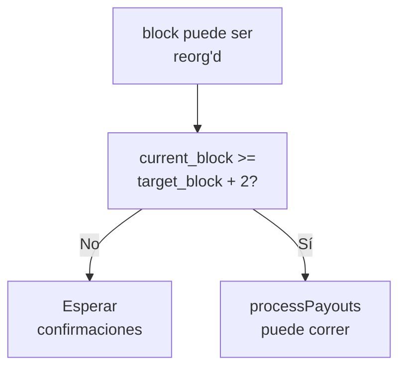

### 4.3 Funciones Auxiliares (champion-call.ts)

| Función | Descripción |
|---------|-------------|
| `calculateResult(block)` | Obtiene hash del bloque y calcula número ganador |
| `getWinners(targetBlock, winningNumber)` | Busca apostadores que acertaron el número |
| `buildAnnouncement(targetBlock, winners, totalSats)` | Construye mensaje de announcement para Nostr |

**Archivos**: `src/lib/cache.ts`, `src/lib/champion-call.ts`

---

## 5. Flujo de Celebración

### 5.1 Potential Winner (0-1 bloque después)

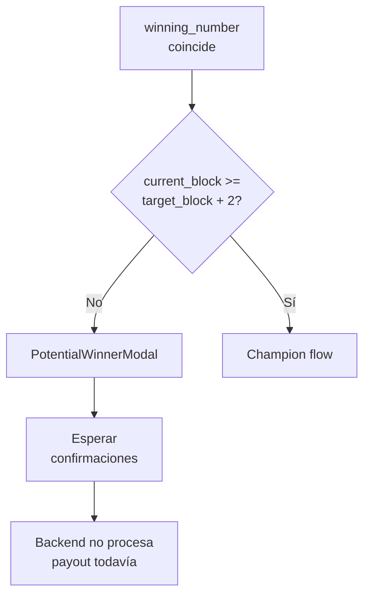

### 5.2 Champion (2+ bloques después)

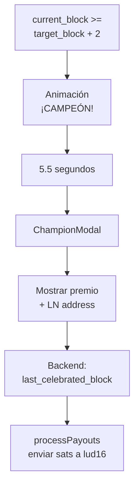

### 5.3 Publicación en Nostr

**IMPORTANTE**: Solo el cron de GitHub Actions publica en Nostr. La función `processPayouts()` NO publica.

| Componente | Publica en Nostr |
|------------|------------------|
| `processPayouts()` / `runFullPayoutCycle()` | ❌ NO (solo hace pagos) |
| GitHub Actions cron | ✅ SÍ (publica announcement) |

**Flujo**:
1. GitHub Actions llama `/api/cron/process-round` cada 5 min
2. El endpoint sincroniza datos y verifica si hay ronda por anunciar
3. Si corresponde, calcula winners y publica en Nostr via `publishRoundResult()`

**Archivos**: `src/hooks/useVictoryCelebration.tsx`, `src/components/ChampionModal.tsx`, `.github/workflows/cron.yml`

---

## 6. Schema de Base de Datos

### lotto_identities

```sql
CREATE TABLE lotto_identities (
    id SERIAL PRIMARY KEY,
    pubkey TEXT NOT NULL UNIQUE,
    nip05 TEXT,
    lud16 TEXT,              -- Lightning address para pagos
    sats_earned INTEGER DEFAULT 0,
    sats_pending INTEGER DEFAULT 0,      -- Sats reservados para el ganador
    winner_block INTEGER DEFAULT 0,       -- Último bloque que ganó
    can_claim BOOLEAN DEFAULT FALSE,      -- true = tiene premio pendiente para reclamar
    last_updated TIMESTAMP WITH TIME ZONE,
    created_at TIMESTAMP WITH TIME ZONE DEFAULT CURRENT_TIMESTAMP
);
```

### lotto_bets

```sql
CREATE TABLE lotto_bets (
    id SERIAL PRIMARY KEY,
    pubkey TEXT NOT NULL,
    alias TEXT,
    selected_number INTEGER NOT NULL,  -- 1-21
    target_block INTEGER NOT NULL,     -- Bloque del sorteo
    betting_block INTEGER NOT NULL,    -- Bloque cuando apostó
    is_paid BOOLEAN DEFAULT FALSE,
    payment_request TEXT,
    payment_hash TEXT UNIQUE,          -- Para confirmar pago
    nostr_event_id TEXT,               -- Protección replay
    created_at TIMESTAMP WITH TIME ZONE DEFAULT CURRENT_TIMESTAMP
);
```

### lotto_payouts

```sql
CREATE TABLE lotto_payouts (
    id SERIAL PRIMARY KEY,
    pubkey TEXT NOT NULL,
    block_height INTEGER NOT NULL,
    amount INTEGER NOT NULL,           -- 21 sats apostadas
    fee INTEGER DEFAULT 0,            -- 2 sats de fee
    type TEXT NOT NULL,               -- 'bet', 'winner', 'fee', 'cycle_resolved'
    status TEXT DEFAULT 'pending',    -- 'pending', 'paid', 'failed'
    tx_hash TEXT,
    bet_id INTEGER REFERENCES lotto_bets(id),
    error_log TEXT,
    created_at TIMESTAMP WITH TIME ZONE DEFAULT CURRENT_TIMESTAMP,
    UNIQUE(pubkey, block_height, type)
);
```

---

## 7. Endpoints API

### GET /api/state

Retorna estado global del juego:
```json
{
  "block": { "height": 890000, "target": 890021, "poolBalance": 150 },
  "activeBets": [...],
  "champions": [...],
  "lastResult": {
    "resolved": true,
    "winningNumber": 7,
    "winners": [...],
    "targetBlock": 890021,
    "blocksUntilCelebration": 0,
    "hasConfirmed": true
  }
}
```

### POST /api/bet

Crea apuesta:
```json
Request: { "signedEvent": {...} }
Response: { "paymentRequest": "lnbc...", "paymentHash": "abc..." }
```

### GET /api/bet?block=X&number=Y&pubkey=Z

Genera invoice para método alternativo (ej: Amber NIP-55).

### GET /api/identity/[pubkey]

Retorna perfil:
```json
{ "alias": "fierillo", "lastCelebrated": 890021, "sats_earned": 15000, "lud16": "fierillo@lawallet.ar" }
```

### POST /api/identity/[pubkey]

Actualiza perfil con evento kind 0 firmado.

---

## 8. Debug Mode

### Activación

```bash
NEXT_PUBLIC_TEST=on npm run dev
```

### Botonera DebugButtons

| Botón | Función |
|-------|---------|
| FLASH | Simula pago exitoso (flash verde) |
| FROZEN | Toggle estado veda |
| RESOLVING | Toggle fin de ronda |
| VICTORY | Fuerza animación campeón + ChampionModal |
| POTENTIAL | Muestra PotentialWinnerModal |
| CHAMPIONS | Inserta/reset test champions en DB |

---

## 9. Ciclo de Juego

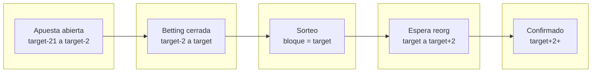

---

## 10. Rate Limiting

El sistema protege contra abuse:

| Endpoint | Límite |
|----------|--------|
| bet:create:pubkey | 10/minuto |
| bet:create:ip | 30/minuto |
| bet:confirm:pubkey | 3/minuto |
| identity:ip | 20/minuto |
| state:ip | 60/minuto |

---

## 11. Seguridad

###Replay Attack Protection
- `nostr_event_id` único por apuesta
- Si ya existe → rechazo

### Firma Desincronizada
- Evento debe tener created_at < 15 min
- Si no → rechazo

### Frozen Betting
- Si current_block >= target_block - 2
- No se aceptan más apuestas

### Validación de Monto Invoice
- Al confirmar pago, el servidor verifica que `tx.amount === 21000` (21 sats = 21000 msats)
- Si el monto es menor → rechazo con error 400
- **Esto previene que un atacante pague 1 sat y se acredite una apuesta completa**

### Encriptación NWC (Argon2)
- El NWC URL se encripta con AES-GCM usando una clave derivada de un PIN de 4 dígitos
- Key derivation: **Argon2id** (preferido, via WASM) con fallback a **PBKDF2** (1M iteraciones)
- Resistencia a brute force: ~1-2 horas para 4 dígitos
- Si Argon2 WASM no está disponible, cae a PBKDF2 automáticamente

---

## 12. GitHub Actions Cron

El sistema usa GitHub Actions para publicar announcements en Nostr sin las limitaciones del cron de Vercel (1 ejecución/día en free tier).

### Configuración

**Repository Variables** (Settings → Variables):
- `APP_URL`: URL de producción (ej: `https://satlotto.vercel.app`)

**Repository Secrets** (Settings → Secrets → Actions):
- `VERCEL_SECRET`: Secret para autenticar el endpoint

### Workflow

```yaml
# .github/workflows/cron.yml
name: Round Announcer
on:
  schedule:
    - cron: '*/5 * * * *'  # Cada 5 minutos
  workflow_dispatch          # Trigger manual desde GitHub UI
```

### Endpoint `/api/cron/process-round`

**Método**: GET

**Headers**:
```
Authorization: Bearer {VERCEL_SECRET}
```

**Respuestas**:

| Status | Significado |
|--------|-------------|
| 200 `{announced: true, block: X, winners: N}` | Ronda anunciada exitosamente |
| 200 `{announced: false, reason: "not_due_yet"}` | Aún no hay ronda para anunciar |
| 200 `{announced: false, reason: "already_announced"}` | Ronda ya была объявлена |
| 401 | Secret incorrecto |
| 500 | Error interno |

### Flujo de Actualización de Bloques

| Origen | Frecuencia | Actualiza cachedBlock |
|--------|------------|---------------------|
| Frontend (GameContext polling) | cada 21 seg | ✅ |
| `/api/bet` | cuando usuario apuesta | ✅ |
| `/api/state` | cuando usuario consulta | ✅ |
| GitHub Actions cron | cada 5 min | ✅ |

**Nota**: `cachedBlock` es una variable en memoria del servidor. En Vercel con múltiples instancias, cada una tiene su propia copia.
